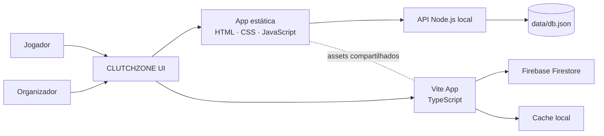

# CLUTCHZONE

> Plataforma competitiva para comunidades de eSports: crie campeonatos, forme equipes, organize pagamentos e mantenha jogadores conectados em tempo real.

<p align="center">
  
  
  
</p>

<p align="center">
  <a href="#visão-geral">Visão geral</a> ·
  <a href="#recursos">Recursos</a> ·
  <a href="#arquitetura">Arquitetura</a> ·
  <a href="#executar-localmente">Executar</a> ·
  <a href="#roadmap">Roadmap</a>
</p>

---

## Visão geral

O **CLUTCHZONE** é um hub de campeonatos pensado para jogadores, capitães e organizadores. O projeto reúne a experiência social de uma plataforma gamer com ferramentas operacionais para torneios: inscrições por equipe, gestão de chaves, pagamento por atleta, sala privada Steam e canais de conversa.

O repositório mantém duas experiências sincronizadas:

| Camada | Objetivo |
| --- | --- |
| **Aplicação estática** | Interface completa em HTML, CSS e JavaScript, atendida por uma API Node.js local. |
| **`cluchzone-app/`** | Evolução em Vite + TypeScript, com módulos de domínio e integração com Firestore. |

## Recursos

### Para jogadores

- Perfil de jogador com nome editável e foto de avatar.
- Criação e gerenciamento de equipes, membros, capitães e reservas.
- Inscrição escolhendo a equipe correta quando o jogador participa de mais de um time.
- Fila solo para completar rosters.
- CLUTCH SOCIAL com sala da comunidade, amigos por nome de usuário, mensagens privadas e chats de equipe.
- Acesso à sala privada da Steam por link ou código de convite, sem depender de IP, porta ou senha de servidor.

### Para organizadores

- Aprovação ou recusa de inscrições e controle de comprovantes.
- Chaves, partidas e resultados do campeonato.
- Painel de pagamentos por equipe **e por jogador** com estados `Pendente`, `Em análise` e `Pago`.
- Exportação de relatório PDF com campeonato, equipes, funções dos atletas e status de pagamento.
- Publicação da sala privada Steam somente para equipes confirmadas.

## Arquitetura



### Estrutura de pastas

```text
.
├── server.js                 # API local, autenticação e arquivos estáticos
├── index.html                # Landing page
├── csgo.*                    # Arena CS2 e fluxo de campeonatos
├── organizer-panel.*         # Operação de inscrições, partidas e pagamentos
├── chat.*                    # CLUTCH SOCIAL e chats de equipes
├── passport.*                # Perfil, avatar e identidade do jogador
├── tournament-details.*      # Inscrição, bracket e sala Steam
└── cluchzone-app/
    └── src/
        ├── core/             # API, autenticação, estado e componentes de UI
        ├── features/         # Domínios de equipes e campeonatos
        ├── pages/            # Controladores das telas
        └── types/            # Contratos TypeScript
```

## Tecnologias

| Área | Tecnologias |
| --- | --- |
| Interface | HTML5, CSS3, JavaScript (ES6+) |
| Aplicação modular | TypeScript, Vite |
| Dados e sincronização | API REST local, Local Storage, Firebase Firestore |
| Autenticação local | Node.js `crypto` com `scrypt` |
| Deploy | Firebase Hosting |

## Executar localmente

### Aplicação estática + API local

**Pré-requisito:** Node.js 18 ou superior.

```bash
git clone https://github.com/rick-pedrinha/Cluchzone.git
cd Cluchzone
npm run dev
```

Abra [http://localhost:3000](http://localhost:3000).

O servidor cria `data/db.json` automaticamente na primeira execução. Esse arquivo é local e não deve ser versionado.

### Versão Vite + TypeScript

```bash
cd cluchzone-app
npm install
npm run dev
```

Para gerar o build de produção:

```bash
npm run build
```

> A integração Firebase usa variáveis `VITE_FIREBASE_*`. Crie um arquivo `cluchzone-app/.env.local` com as credenciais do seu projeto Firebase antes de executar a versão Vite em outro ambiente.

## Qualidade e segurança

- A API local bloqueia acesso direto a `.git` e ao diretório `data/`.
- Senhas locais são armazenadas com `scrypt` e salt aleatório.
- A aplicação usa cache local como fallback para uma experiência mais resiliente.
- Regras e índices do Firestore estão versionados em `firebase.rules` e `firebase.indexes.json`.

## Roadmap

- [x] Campeonatos, equipes, inscrições e brackets.
- [x] Perfil com avatar e nome exibido em toda a plataforma.
- [x] Chat social, amigos, mensagens privadas e chats de equipe.
- [x] Painel individual de pagamentos e relatório PDF.
- [x] Salas privadas Steam por convite.
- [ ] Notificações push e moderação avançada.
- [ ] Integração de estatísticas oficiais por jogo.
- [ ] Painel administrativo com métricas e auditoria de eventos.

## Autor

Desenvolvido por [Rick Pedrinha](https://github.com/rick-pedrinha) como projeto de portfólio focado em produto, experiência competitiva e operação de comunidades eSports.

---

<p align="center"><strong>CLUTCHZONE</strong> — onde a comunidade entra no jogo.</p>
